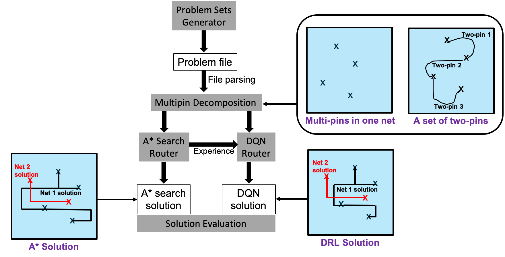
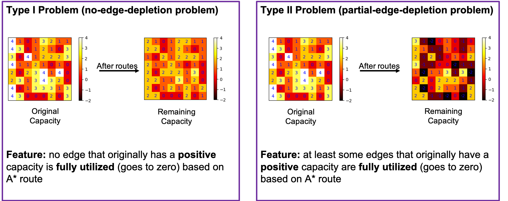
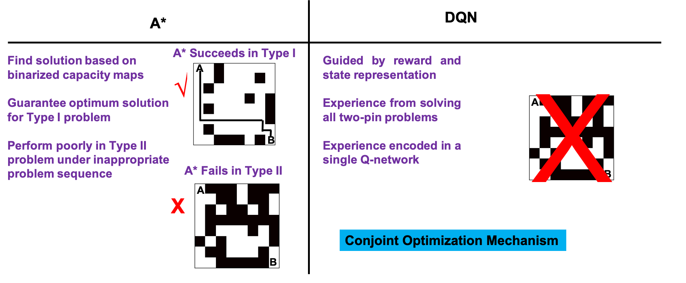

## Deep Reinforcement Learning Global Routing
This project is based on our published paper "A Deep Reinforcement Learning Approach for Global Routing" (https://arxiv.org/pdf/1906.08809.pdf).
It uses deep Q-learning (DQN) to solve the challenging global routing problem by leveraging the "conjoint optimization" mechanism  of DQN. Superior performance compared to A* search (which is a typical baseline routing algorithm) in certain types of problems. As shown in the picture, the pipeline consists of "problem sets generator (see another open source Github repo: haiguanl/GlobalRoutingProblemGenerator for deatails)", "multipin decomposition", "A*Search Router" and "DQN Router".
<p align="center">

</p>

Two types problems are defined to analyze the results (Type I/Type II). Some basic definitions and why DQN works better than A* in Type II problems are shown below. Interestingly, most circuits design problems could be ascribeed as Type II, where the most important feature is that routing resource is scarce (some edges's capacity used up during routing). 

<p align="center">

</p>
<p align="center">

</p>

The following set up and manual is based on Ubuntu system, and may slightly vary on a Linux or Redhat system.
#### 1. Environment Setup:

To setup your environment (which contains depencies with the correct version), use the conda environment specified in environment.yml by simply doing the following with a recent version of conda in Linux/Bash (https://conda.io/projects/conda/en/latest/user-guide/install/index.html), in the repository path:
```
conda env create
source activate DRL_GR
```
To deactivate the virtual environment:
'''
conda deactivate
'''

#### 2. Running Experiment
To run the experiment, first make sure the conda environment is activated. 
The following command runs the pipeline, which include all function blocks including the problem generator, but not the evaluation part. 
```
python GenSolEvalComp_Pipeline.py --benchNumber 100 --gridSize 8 --netNum 20 --capacity 4 --maxPinNum 5 --reducedCapNum 3
```
Arguments definitions:
- benchNumber: number of problems in the experiment
- grid size: size of a problem, e.g. 8 means the problem space is on an 8-by-8 two layers routing area
- netNum: number of nets that will needs to be routed
- capacity: edge capacity for problem (check paper for details)
- maxPinNum: max number of pins in a net, the number of pins in one net follows a uniform distribution between [0,maxPinNum]
- reducedCapNum: number of edges that has reduced capacity (blolcked or partially blocked, check problem genrator part of the code for details and make modification to your needs: for example, do you want to block edges randomly or just block high congestion area)

#### 3. Results Evaluation
Results are analyzed in lots of different angles, and there are some detailed results analysis we need in the paper.
To evaluate the results by yourself, check one of our sample result folder such as "ExperimentResults/Results_Apr1119_Shuffle02". There you will find following folders:
- capacityPlot_A*: reults like edge utilization statitstics before and after A* route, or heat map, for generated problems without any edges blocked
- capacityPlot_A*_reduced:reults like edge utilization statitstics before and after A* route, or heat map,  for generated problems with specified edges blockage
- eval: this is the real results evaluation, which can be executed by run "Evaluation.py" and it will call ""eval200.pl" (from ISPD 2008 Contest). Before evaluate, make sure you have put problem files (such as "test_benchmark_74.gr", this is also the same format as ISPD2 2008 Contest) and solution file (such as "test_benchmark_74.grAstar_solution") into the same folder.


